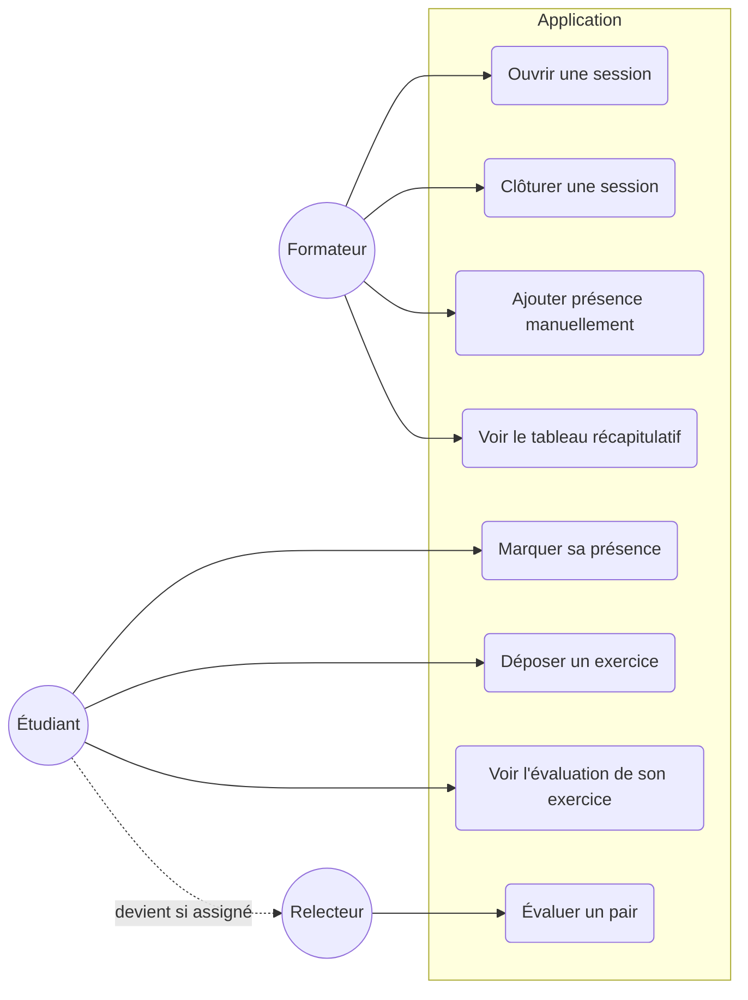

# D1 — Diagramme des Cas d'Utilisation

```mermaid
flowchart LR
    %% Acteurs
    F((Formateur))
    E((Étudiant))
    R((Relecteur))

    %% L'étudiant peut devenir relecteur
    E -.->|devient si assigné| R

    %% Cas d'utilisation Formateur
    subgraph Application
        UC1(Ouvrir une session)
        UC2(Clôturer une session)
        UC3(Ajouter présence manuellement)
        UC4(Voir le tableau récapitulatif)
        
        UC5(Marquer sa présence)
        UC6(Déposer un exercice)
        UC8(Voir l'évaluation de son exercice)
        
        UC7(Évaluer un pair)
    end

    %% Relations Formateur
    F --> UC1
    F --> UC2
    F --> UC3
    F --> UC4

    %% Relations Étudiant
    E --> UC5
    E --> UC6
    E --> UC8

    %% Relations Relecteur
    R --> UC7
```
