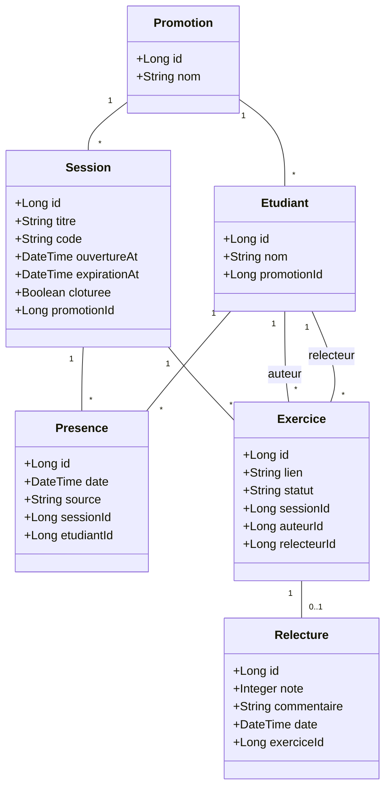

# D2 — Diagramme de Classes / Modèle de Données

Ce diagramme décrit les entités de l'application et leurs relations. Il doit servir de base stricte pour les migrations de base de données (Flyway/Liquibase).

