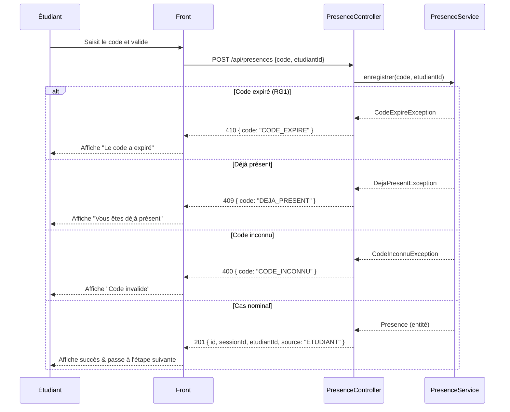

# D3 — Séquence : Marquer sa présence

Ce diagramme illustre le cas nominal et les cas d'erreur de la soumission du code de présence, conformément aux codes HTTP du contrat d'API.

```mermaid
sequenceDiagram
    participant E as Étudiant
    participant F as Front
    participant API as PresenceController
    participant S as PresenceService
    
    E->>F: Saisit le code et valide
    F->>API: POST /api/presences {code, etudiantId}
    API->>S: enregistrer(code, etudiantId)
    
    alt Code expiré (RG1)
        S-->>API: CodeExpireException
        API-->>F: 410 { code: "CODE_EXPIRE" }
        F-->>E: Affiche "Le code a expiré"
        
    else Déjà présent
        S-->>API: DejaPresentException
        API-->>F: 409 { code: "DEJA_PRESENT" }
        F-->>E: Affiche "Vous êtes déjà présent"
        
    else Code inconnu
        S-->>API: CodeInconnuException
        API-->>F: 400 { code: "CODE_INCONNU" }
        F-->>E: Affiche "Code invalide"
        
    else Cas nominal
        S-->>API: Presence (entité)
        API-->>F: 201 { id, sessionId, etudiantId, source: "ETUDIANT" }
        F-->>E: Affiche succès & passe à l'étape suivante
    end
```
