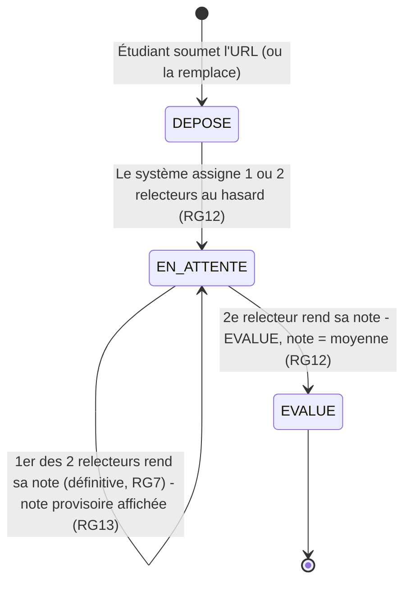

# D4 — États-transitions : Cycle de vie d'un exercice

*(Diagramme bonus)*

> **Révisé étape 3 (RG12/RG13) :** avant, `EN_ATTENTE → EVALUE` se faisait en une seule transition (1 seul relecteur). Maintenant `EN_ATTENTE` a une auto-transition pour la 1ʳᵉ des 2 relectures reçues (note provisoire, exercice pas encore `EVALUE`) avant la transition finale vers `EVALUE` à la 2ᵉ.
