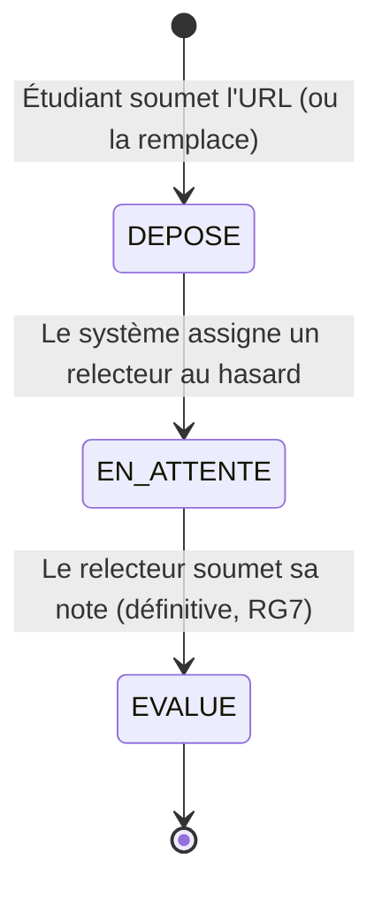

# D4 — États-transitions : Cycle de vie d'un exercice

*(Diagramme bonus)*

```mermaid
stateDiagram-v2
    [*] --> DEPOSE : Étudiant soumet l'URL (ou la remplace)
    
    DEPOSE --> EN_ATTENTE : Le système assigne un relecteur au hasard
    
    EN_ATTENTE --> EVALUE : Le relecteur soumet sa note (définitive, RG7)
    
    EVALUE --> [*]
```
